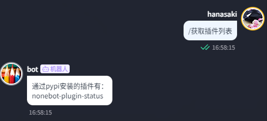
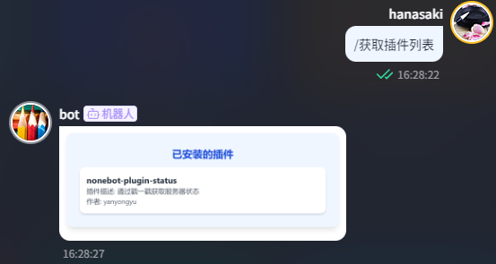
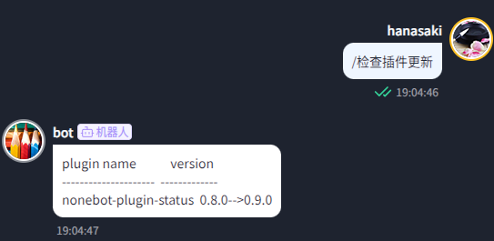
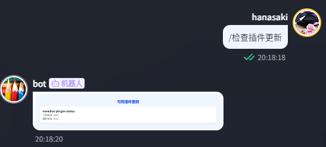
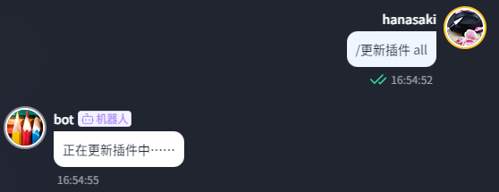
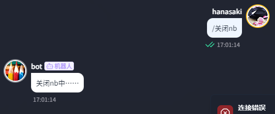
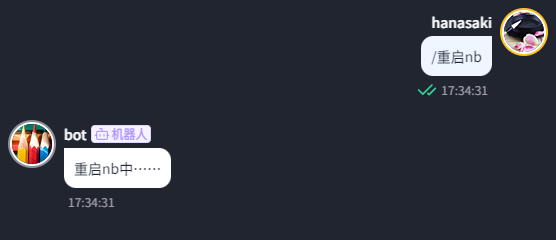

<div align="center">

<a href="https://v2.nonebot.dev/store">
    
</a>

# nonebot-plugin-updater

[](./LICENSE)
[](https://pypi.python.org/pypi/nonebot-plugin-updater)


</div>

## 📖 介绍

一款全新的检测已安装插件更新情况的插件

## 💿 安装

<details open>
<summary>使用 nb-cli 安装</summary>

在 nonebot2 项目的根目录下打开命令行, 输入以下指令即可安装

```sh
    nb plugin install nonebot-plugin-updater
```

</details>

<details>
<summary>使用包管理器安装</summary>

在 nonebot2 项目的插件目录下, 打开命令行, 根据你使用的包管理器, 输入相应的安装命令

<details>
<summary>pip</summary>

```sh
  pip install nonebot-plugin-updater
```

</details>

打开 nonebot2 项目根目录下的 `pyproject.toml` 文件, 在 `[tool.nonebot]` 部分追加写入

```python
    plugins = ["nonebot_plugin_updater"]
```

</details>

## ⚠️ 注意

此插件只支持`nb-cli`用户 ~~没用 cli 安装的项目使用的 python 路径太复杂了~~

## 🎉 使用

### 🔧 插件配置

请在你的 bot 根目录下的`.env` `.env.*`中添加以下字段

|      字段      | 类型 |      默认值      |    可选值     |          描述           | 必填 |
| :------------: | :--: | :--------------: | :-----------: | :---------------------: | :--: |
|  GITHUB_PROXY  | str  | "" |       -       |       GitHub 代理       |  否  |
| INFO_SEND_MODE | str  |      "pic"       | "text", "pic" | 发送插件信息/更新的方式 |  否  |

### ✨ 功能介绍

- 获取已安装插件列表 <br>
  
  

- 检查插件更新<br>
  
  

- 更新插件<br>
  

- 安装插件<br>

- 卸载插件<br>

- 远程关闭 nb<br>
  

- 远程重启 nb <br>
  

### 🤖 指令表

⚠️ 此处示例中的"/"为 nb 默认的命令开始标志，若您设置了另外的标志，则请使用您设置的标志作为开头

|             指令              |    权限    | 需要@ |                           说明                            |               示例                |
| :---------------------------: | :--------: | :---: | :-------------------------------------------------------: | :-------------------------------: |
|        `获取插件列表`         |     无     |  无   |                   获取已安装的插件列表                    |          `/获取插件列表`          |
|        `检查插件更新`         |     无     |  无   |                    检查可用的插件更新                     |          `/检查插件更新`          |
| `更新插件 <需要更新的插件名>` | SUPERUSERS |  无   | 更新插件。若需更新的插件名为`all`，则更新所有已安装的插件 | `/更新插件 nonebot-pluign-status` |
| `安装插件 <需要安装的插件名>` | SUPERUSERS |  无   |                       安装指定插件                        | `/安装插件 nonebot-pluign-status` |
| `卸载插件 <需要卸载的插件名>` | SUPERUSERS |  无   |                       卸载指定插件                        | `/卸载插件 nonebot-pluign-status` |
|           `关闭nb`            | SUPERUSERS |  无   |                        远程关闭 nb                        |             `/关闭nb`             |
|           `重启nb`            | SUPERUSERS |  无   |                        远程重启 nb                        |             `/重启nb`             |

### 🚩 TODO

- [x] 使用 html 渲染插件列表及插件更新列表
- [x] 处理插件模块名与 project_link 不一致的插件
- [x] 添加安装/卸载插件的功能

## 致谢

感谢[nonebot-plugin-runagain](https://github.com/NCBM/nonebot-plugin-runagain)对本项目的启发 ~~(直接开抄)~~
