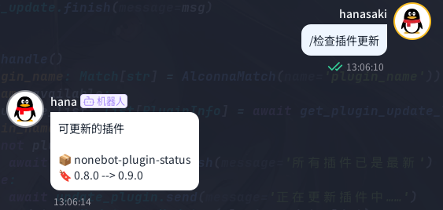

<div align="center">

<a href="https://v2.nonebot.dev/store">
    
</a>

# nonebot-plugin-updater

[](./LICENSE)
[](https://pypi.python.org/pypi/nonebot-plugin-updater)


</div>

## 📖 介绍

简单的天气排行榜

## 💿 安装

<details open>
<summary>使用 nb-cli 安装</summary>

在 nonebot2 项目的根目录下打开命令行, 输入以下指令即可安装

```sh
    nb plugin install nonebot-plugin-updater
```

</details>

<details>
<summary>使用包管理器安装</summary>

在 nonebot2 项目的插件目录下, 打开命令行, 根据你使用的包管理器, 输入相应的安装命令

<details>
<summary>pip</summary>

```sh
  pip install nonebot-plugin-updater
```

</details>

打开 nonebot2 项目根目录下的 `pyproject.toml` 文件, 在 `[tool.nonebot]` 部分追加写入

```python
    plugins = ["nonebot_plugin_updater"]
```

</details>

## ⚠️ 注意

此插件只支持`nb-cli`用户~~（没用 cli 安装的项目使用的路径太复杂了）~~

## 🎉 使用

### 🔧 插件配置

请在你的 bot 根目录下的`.env` `.env.*`中添加以下字段

|      字段      | 类型 |               默认值               |    可选值     |          描述           | 必填 |
| :------------: | :--: | :--------------------------------: | :-----------: | :---------------------: | :--: |
| PYPI_INFO_URL  | str  | "https://mirrors.ustc.edu.cn/pypi" |       -       | 获取 pypi 包信息的 url  |  否  |
| INFO_SEND_MODE | str  |               "pic"                | "text", "pic" | 发送插件信息/更新的方式 |  否  |

### ✨ 功能介绍

- 获取已安装插件列表 <br>
  

- 检查插件更新<br>
  
  

- 更新插件<br>
  
  

- 远程关闭 nb<br>
  

- 远程重启 nb <br>
  

### 🤖 指令表

⚠️ 此处示例中的"/"为 nb 默认的命令开始标志，若您设置了另外的标志，则请使用您设置的标志作为开头

调用插件的主命令为"天气"

|      指令      | 权限 | 需要@ |                                       说明                                       |                  示例                  |
| :------------: | :--: | :---: | :------------------------------------------------------------------------------: | :------------------------------------: |
| `获取插件列表` |  无  |  无   |                               获取已安装的插件列表                               |            `/获取插件列表`             |
| `检查插件更新` |  无  |  无   |                                检查可用的插件更新                                |            `/检查插件更新`             |
|   `更新插件`   |  无  |  无   | 更新已安装的插件，若需只更新单个插件，则指令为`更新插件 name <需要更新的插件名>` | `/更新插件 name nonebot-pluign-status` |
|    `关闭nb`    |  无  |  无   |                                  远程关闭 nb nb                                  |               `/关闭nb`                |
|    `重启nb`    |  无  |  无   |                                  远程重启 nb nb                                  |               `/重启nb`                |

### 🚩 TODO

- [x] 使用 html 渲染插件列表及插件更新列表

## 致谢

感谢[nonebot-plugin-runagain](https://github.com/NCBM/nonebot-plugin-runagain)对本项目的启发 ~~(直接开抄)~~ 。`nonebot-plugin-runagain`在重启后原进程仍存在，会导致重启后使用`Ctrl+C`正常无法关闭 uvicorn server，本项目中采用对其进行了改进，上述问题得以解决。
